# 标准化模块图片导航

<table>
    <tr>
    <td>
<a href="https://xmu-rm-hwsd-um.readthedocs.io/en/latest/Bluetooth/">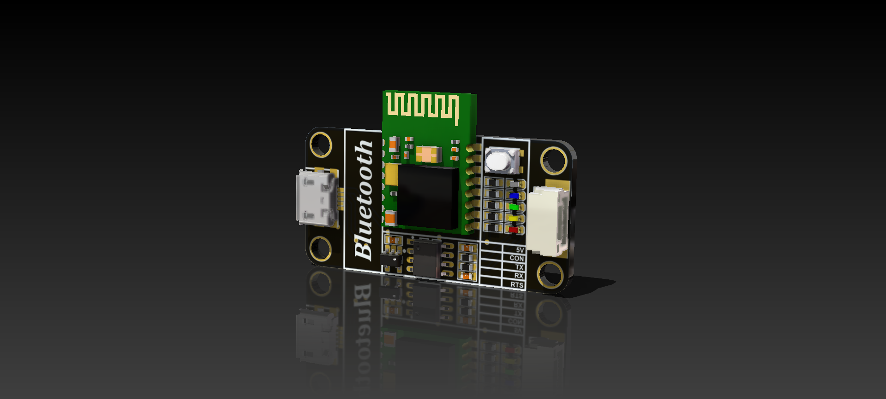</a>
    <td>

    <td>

    <td>

    </tr>  
    <tr>
    <td>
<a href="https://xmu-rm-hwsd-um.readthedocs.io/en/latest/DAPLink/">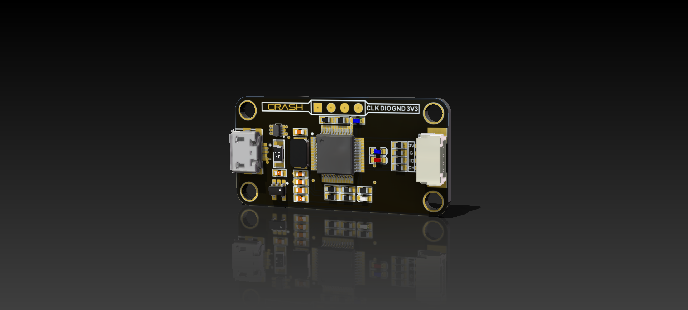</a>
    <td>
<a href="https://xmu-rm-hwsd-um.readthedocs.io/en/latest/DBUS/">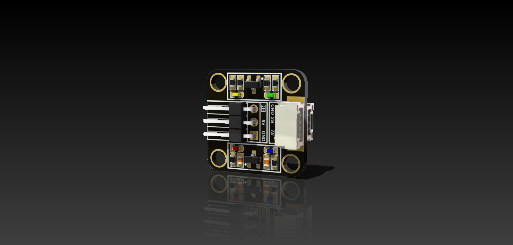</a>
    <td>
<a href="https://xmu-rm-hwsd-um.readthedocs.io/en/latest/PowerConvert/">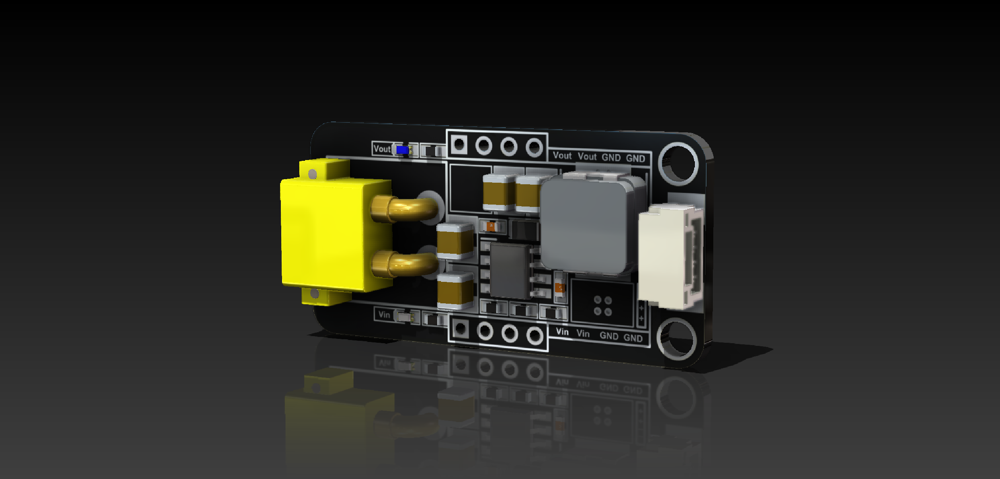</a>    
    <td>
<a href="https://xmu-rm-hwsd-um.readthedocs.io/en/latest/Detector/">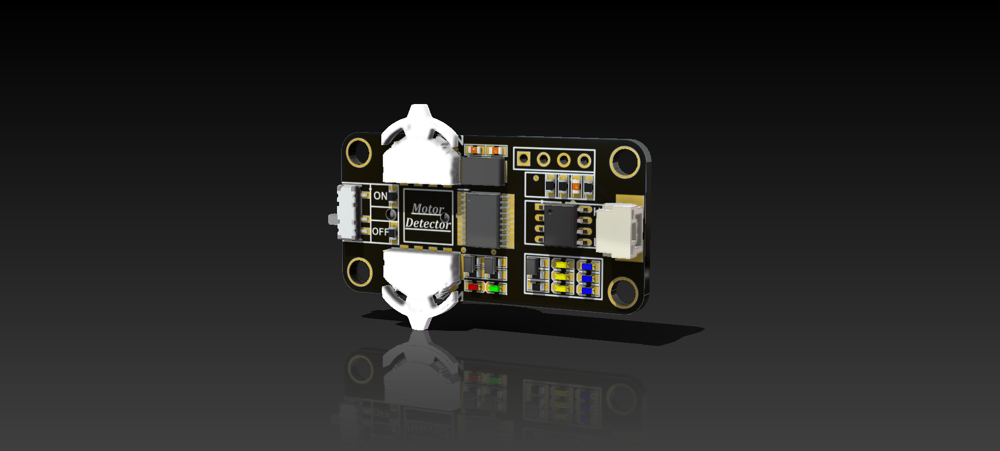</a>    
    </tr>
    <tr>
    <td>
<a href="https://xmu-rm-hwsd-um.readthedocs.io/en/latest/GH2GH/">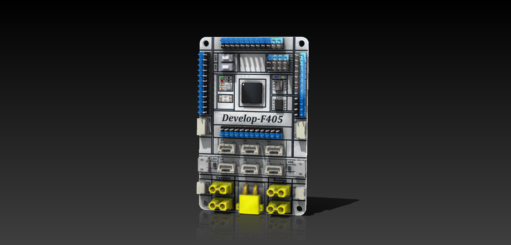</a>        
    <td>
<a href="https://xmu-rm-hwsd-um.readthedocs.io/en/latest/GH2GH/">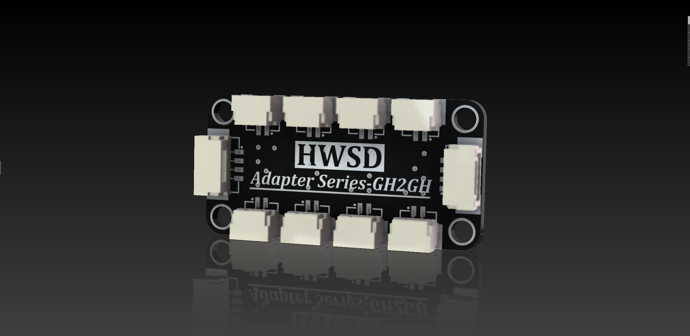</a>
    <td>
<a href="https://xmu-rm-hwsd-um.readthedocs.io/en/latest/Gyroscope/">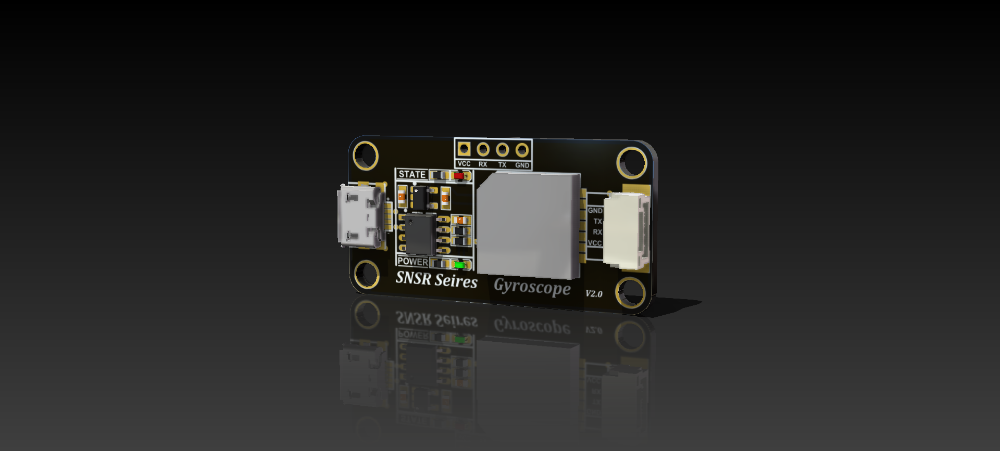</a>
    <td>
<a href="https://xmu-rm-hwsd-um.readthedocs.io/en/latest/H-bridge/">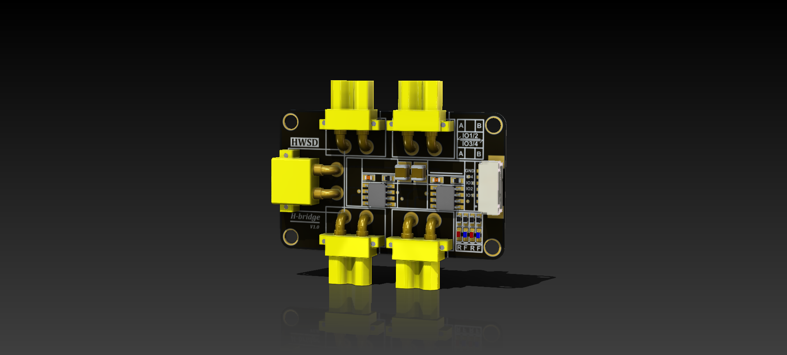</a>     
    </tr>
    <tr>
    <td>
           
    <td>
<a href="https://xmu-rm-hwsd-um.readthedocs.io/en/latest/PowerConvert/">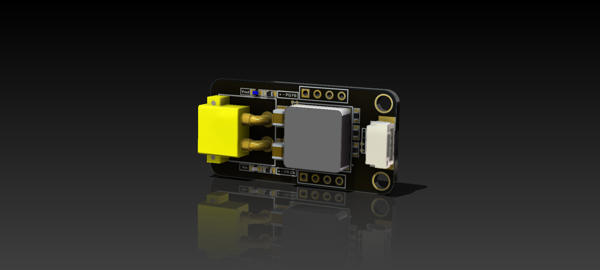</a>
    <td>
<a href="https://xmu-rm-hwsd-um.readthedocs.io/en/latest/PowerMonitor/">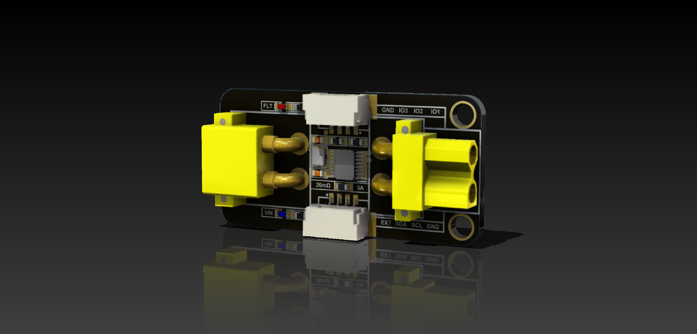</a>    
    <td>
<a href="https://xmu-rm-hwsd-um.readthedocs.io/en/latest/Robotics/">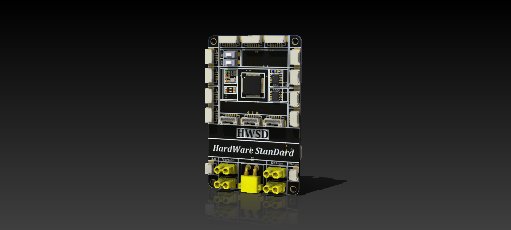</a> 
    </tr>
    <tr>
    <td>
<a href="https://xmu-rm-hwsd-um.readthedocs.io/en/latest/PowerConvert/">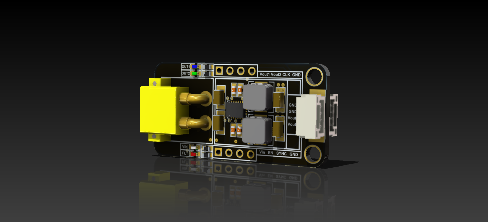</a>           
    <td>
<a href="https://xmu-rm-hwsd-um.readthedocs.io/en/latest/PowerProtect/">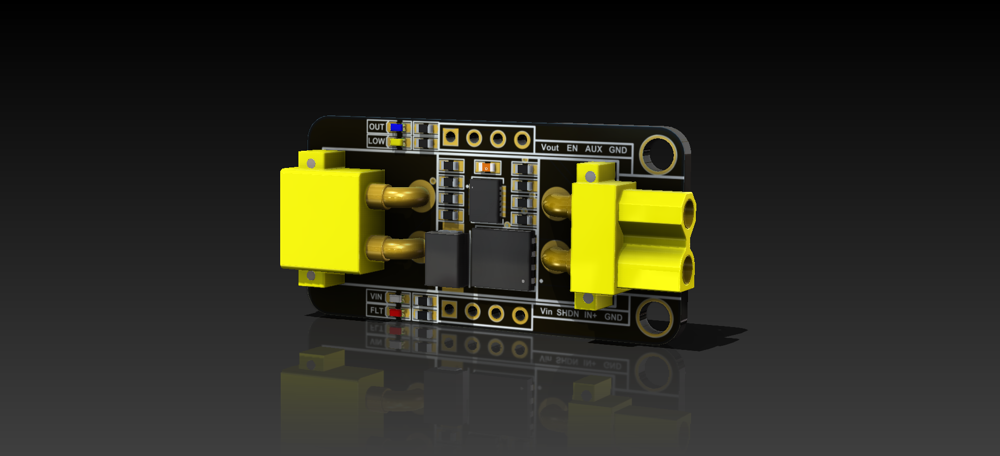</a>       
    <td>
<a href="https://xmu-rm-hwsd-um.readthedocs.io/en/latest/USB2TTL/">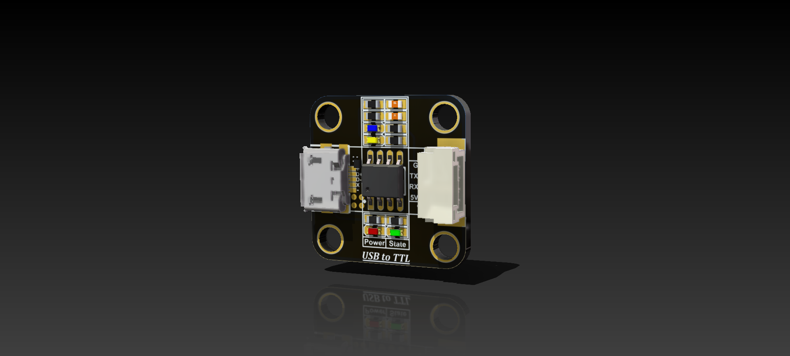</a>
    <td>
<a href="https://xmu-rm-hwsd-um.readthedocs.io/en/latest/WiFi/">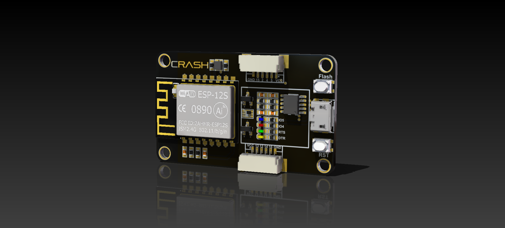</a>
    </tr>  
    <tr>
    <td>
<a href="https://xmu-rm-hwsd-um.readthedocs.io/en/latest/WiFi/">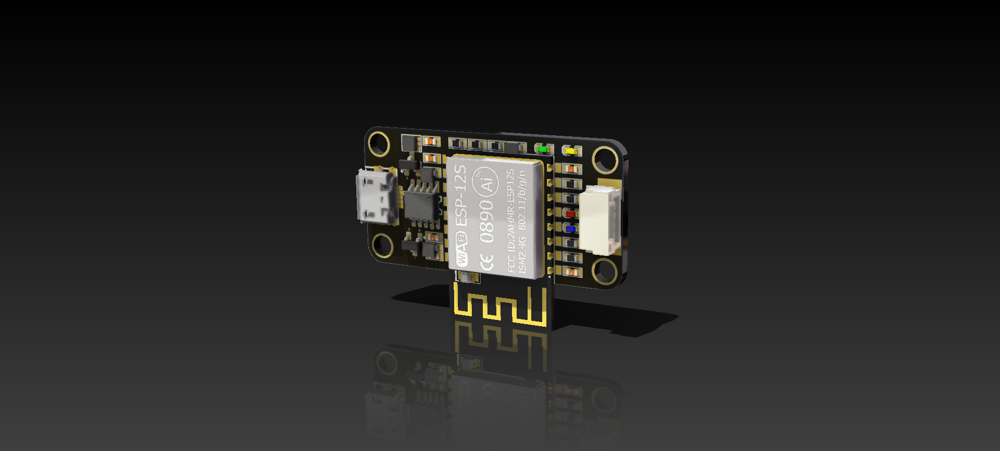</a>     
    <td>
   
    <td>

    <td>
     
    </tr>         
</table>

---

本篇总访问量次
