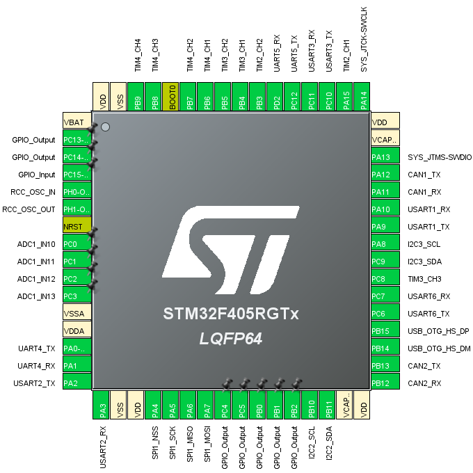
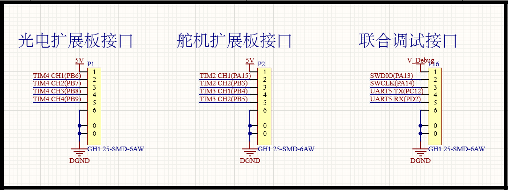
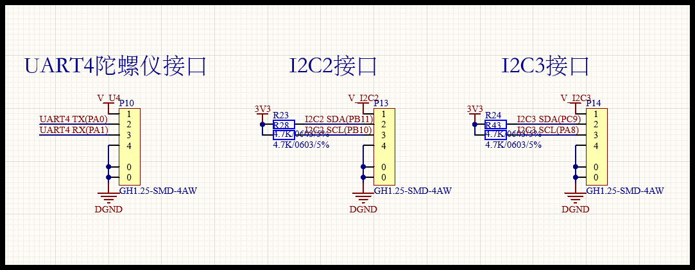
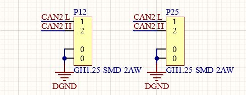
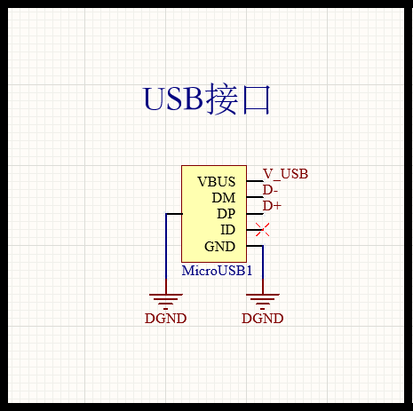
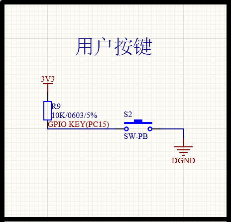
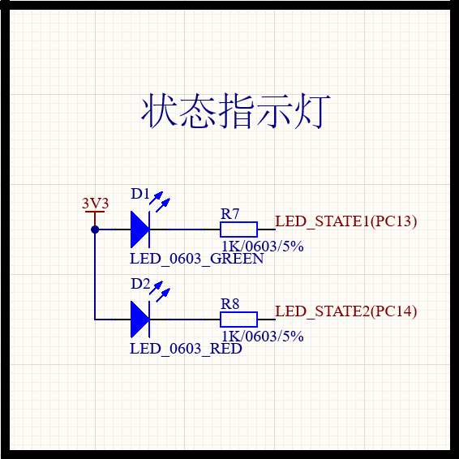
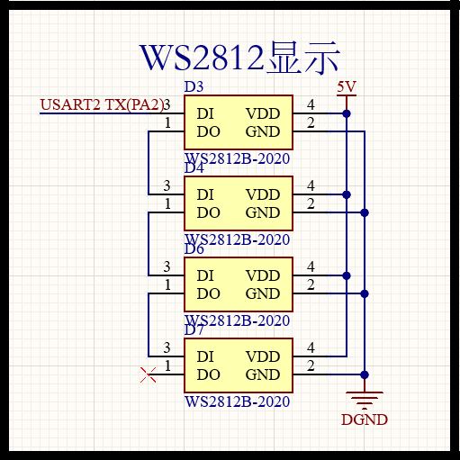
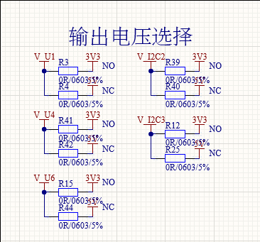

# HWSD-MAIN for Robotics 用户手册

---

> ***Text Content Version:1.0***
>
> ***Board Supporting Version: 2.0***

---

## 资源概述

MCU：STM32F504RGT6

CAN Transceiver：SN65HVD232

功能：基于接口实现的功能阵列

| GPIO | UART | CAN  | I2C  | SPI  | USB  |
| ---- | ---- | ---- | ---- | ---- | ---- |
| 28   | 5    | 2    | 2    | 1    | 1    |

交互：基于按键实现的用户交互

| 用户按键 | 复位按键 |
| -------- | -------- |
| 1        | 1        |

指示：基于LED的状态指示阵列

| 电源故障 | 电源良好 | 电源供电 | 电压轨 | 用户可控 | 用户可控全彩 |
| -------- | -------- | -------- | ------ | -------- | ------------ |
| 1        | 2        | 2        | 2      | 2        | 4            |

接口：标准化接口定义映射阵列

| 接口\线序         | 1                      | 2    | 3    | 4    | 5    | 6    | 数量 |
| ----------------- | ---------------------- | ---- | ---- | ---- | ---- | ---- | ---- |
| **6Pin 扩展接口** | 5V                     | IO1  | IO2  | IO3  | IO4  | GND  | 5    |
| **6Pin 调试接口** | VCC                    | DIO  | CLK  | TX   | RX   | GND  | 1    |
| **4Pin 扩展接口** | L                      | L    | H    | H    |      |      | 2    |
| **4Pin 调试接口** | VCC                    | RX   | TX   | GND  |      |      | 1    |
| **4Pin 调试接口** | CLK                    | DIO  | GND  | VCC  |      |      | 1    |
| **4Pin 通信接口** | 5V/3.3V                | TX   | RX   | GND  |      |      | 4    |
| **4Pin 通信接口** | 5V/3.3V                | SDA  | SCL  | GND  |      |      | 2    |
| **3Pin 舵机接口** | PWM                    | 5V   | GND  |      |      |      | 1    |
| **3Pin 遥控接口** | $\overline{\text{RX}}$ | 5V   | GND  |      |      |      | 1    |
| **2Pin 电机接口** | L                      | H    |      |      |      |      | 2    |
| **USB 通信接口**  | 5V                     | D-   | D+   | NC   | GND  |      | 1    |

---

## 接口布局

<table>
    <tr>
        <td>
        <td>
        </td>
    </tr>
</table>

## 管脚映射

---

## 功能解析

#### 6Pin 扩展接口 & 调试接口

<table>
    <tr>
        <td>
        <td>
        <td>
        </td>
    </tr>
</table>
#### 4Pin 扩展接口 & 调试接口

<table>
    <tr>
        <td>
        <td>
        <td>
        </td>
    </tr>
</table>
		调试接口接入3.3V电压，3.3V电压轨开启，5V电压轨关闭，调试电压轨指示LED（黄色）熄灭；
		调试接口接入5V电压，5V电压轨和3.3V电压轨同步开启，调试电压轨指示LED（黄色）点亮。	

#### 4Pin 通信接口

<table>
    <tr>
        <td>
        <td>
        <td>
        </td>
    </tr>
</table>

#### 3Pin 舵机接口 & 遥控接口

<table>
    <tr>
        <td>
        <td>
        </td>
    </tr>
</table>

#### 2Pin 电机接口

		板级CAN网络已并联120R终端电阻。

#### USB接口

		USB接口接入不低于3.3V的电压输入，5V和3.3V电压轨开启，USB电压轨指示LED（绿色）点亮。

#### 用户按键

		用户按键连接至PC15管脚，通过10K电阻上拉。用户按键按下，PC15接地。

#### 状态指示

		绿色LED连接至PC13，红色LED连接至PC14，低电平点亮。

#### 全彩LED显示

		RBG IC使用WS2812B，连接至PA2管脚。

#### 输出电压选择

		4pin 通信接口支持5V/3.3V输出电压选择，通过焊接0R电阻实现，默认5V常闭，3.3V常开。

---

>***Designed by：ASR-Crash***
>
>***Authorized to：XMU Robot Team，Electronic Control Group***

---

