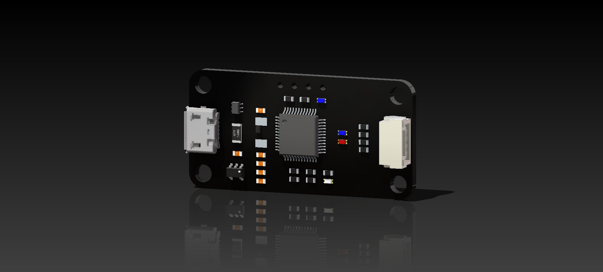
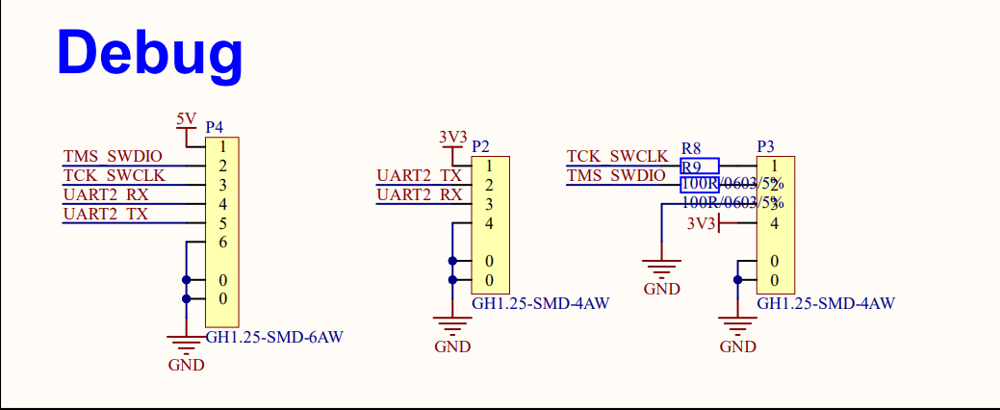

# HWSD-DAPLINK 用户手册

---

> ***Text Content Version:1.0***
>
> ***Board Supporting Version: 2.0***

---

## 资源概述

MCU：STM32F103C8T6

CAN Transceiver：SN65HVD232

指示：基于LED的状态指示阵列

| 5V电源 | 3V电源 | 连接指示 | 运行指示 |
| ------ | ------ | -------- | -------- |
| 白色   | 蓝色   | 蓝色     | 红色     |

接口：标准化接口定义映射阵列

| 接口\线序         | 1    | 2    | 3    | 4    | 5    | 6    | 数量 |
| ----------------- | ---- | ---- | ---- | ---- | ---- | ---- | ---- |
| **6Pin 调试接口** | 5V   | DIO  | CLK  | RX   | TX   | GND  | 1    |
| **USB 通信接口**  | 5V   | D-   | D+   | NC   | GND  |      | 1    |
| **4Pin 调试接口** | CLK  | DIO  | GND  | 3.3V |      |      | 1    |
| **4Pin 调试接口** | 3.3V | TX   | RX   | GND  |      |      | 1    |

---

## 接口布局

## 连接说明

#### 调试接口

		3个调试接口可以使用直连线与MAIN系列调试接口连接
		注意：因电压轨不同，不能同时接入6Pin和4Pin调试

#### 编程接口

		调试接口接入3.3V电压，3.3V电压轨开启，5V电压轨关闭，调试电压轨指示LED（黄色）熄灭；
		调试接口接入5V电压，5V电压轨和3.3V电压轨同步开启，调试电压轨指示LED（黄色）点亮。	

#### 4Pin 通信接口

<table>
    <tr>
        <td>
        <td>
        <td>
        </td>
    </tr>
</table>

#### 3Pin 舵机接口 & 遥控接口

<table>
    <tr>
        <td>
        <td>
        </td>
    </tr>
</table>

#### 2Pin 电机接口

		板级CAN网络已并联120R终端电阻。

#### USB接口

		USB接口接入不低于3.3V的电压输入，5V和3.3V电压轨开启，USB电压轨指示LED（绿色）点亮。

#### 用户按键

		用户按键连接至PC15管脚，通过10K电阻上拉。用户按键按下，PC15接地。

#### 状态指示

		绿色LED连接至PC13，红色LED连接至PC14，低电平点亮。

#### 全彩LED显示

		RBG IC使用WS2812B，连接至PA2管脚。

#### 输出电压选择

		4pin 通信接口支持5V/3.3V输出电压选择，通过焊接0R电阻实现，默认5V常闭，3.3V常开。

---

>***Designed by：ASR-Crash***
>
>***Authorized to：XMU Robot Team，Electronic Control Group***

---

